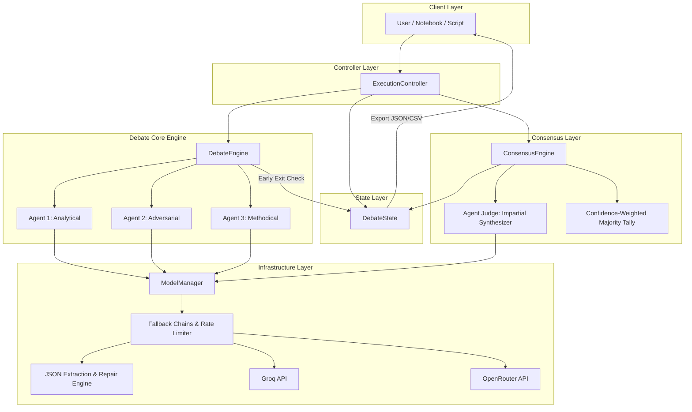
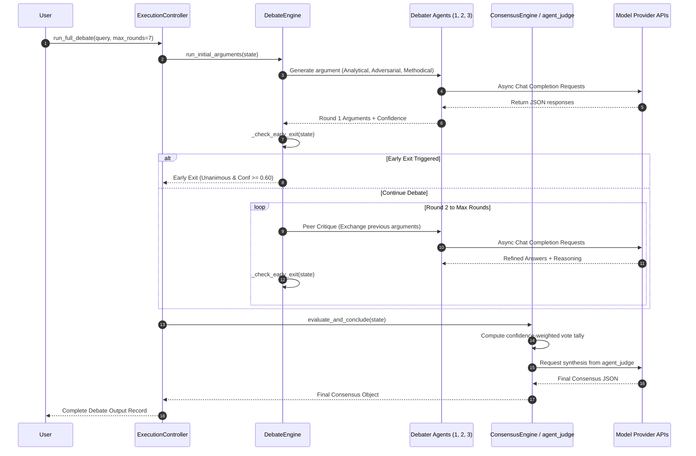
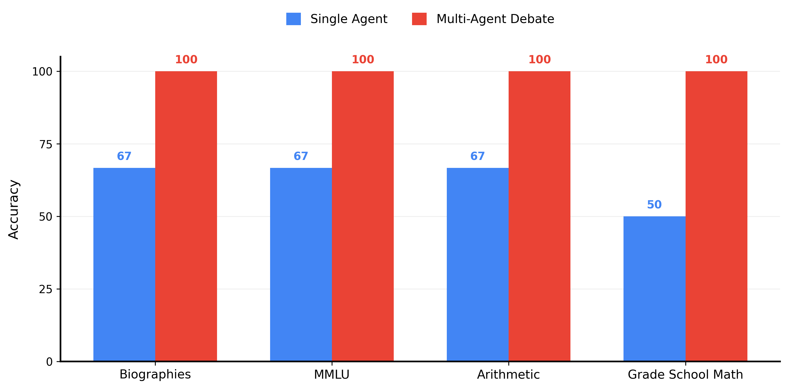
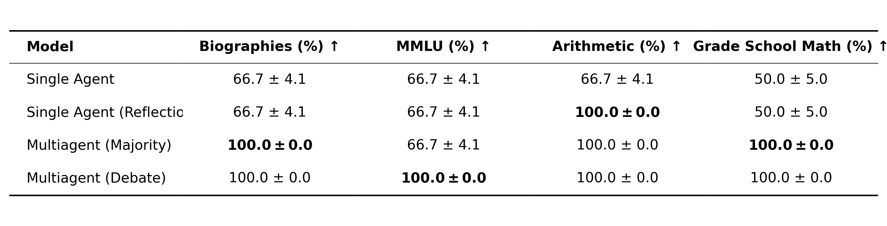

# Multi-Agent Debate Framework
**David vs. Goliath: Achieving High-Parameter Accuracy through Orchestrated Multi-Agent Debate**


---

## 1. Overview

The **Multi-Agent Debate Framework** is a research-grade experimental platform designed to evaluate whether multiple small-to-medium Large Language Models (LLMs) collaborating through structured, role-differentiated debate can match or exceed the accuracy, reasoning quality, and factual reliability of much larger high-parameter models while mitigating individual model hallucinations and single-point-of-failure vulnerabilities.

Instead of relying on a single monolithic LLM output, this system orchestrates a panel of heterogeneous debater agents (`agent_1`, `agent_2`, `agent_3`) operating under specialized cognitive personas (Analytical Fact-Checker, Adversarial Skeptic, Methodical Synthesizer). The debaters present initial arguments, cross-examine each other's step-by-step reasoning, refine their positions across iterative rounds, and submit their responses to an impartial consensus judge (`agent_judge`) backed by confidence-weighted majority tallying.

### Main Outcomes Produced by the System
* **Higher Decision Accuracy**: Demonstrates measurable accuracy gains across complex benchmarks (Grade School Math / GSM8K, MMLU, Arithmetic, Factual Biographies, and Chess Logic) compared to single-agent baseline execution.
* **Early Exit Latency Savings**: Automatically detects early multi-agent agreement via a dynamic tripwire mechanism, bypassing redundant debate rounds to minimize API latency and token cost.
* **Fault-Tolerant Execution**: Built with multi-level fallback model chains, automatic JSON extraction and repair, and isolated exception handling to ensure uninterrupted debate execution even under API rate limits or model failures.

---

## 2. Problem Statement

### Existing Problem
Single Large Language Models, regardless of their size, are vulnerable to critical failure modes:
1. **Hallucination & Factual Drift**: Models confidently generate incorrect facts, invented citations, or flawed historical events without self-correction.
2. **Logical & Calculation Errors**: Complex multi-step mathematical operations and formal logic reasoning frequently collapse in single-pass generation.
3. **Single-Point-of-Failure**: In production AI pipelines, depending on a single model endpoint exposes the system to complete failure if that model returns malformed output, hits a rate limit, or experiences service interruption.
4. **Self-Reflection Inefficiency**: Asking a single model to reflect on its own errors often results in confirmation bias, where the model reinforces its initial incorrect premise.

### How This Project Solves the Problem
This framework addresses these limitations through **Multi-Agent Cross-Examination**:
* **Heterogeneous Persona Diversity**: By assigning explicit, non-overlapping roles (Analytical, Adversarial, Methodical), agents actively challenge hidden assumptions and uncover edge cases that a single model overlooks.
* **Iterative Refinement**: Multi-round critique forces agents to justify their reasoning against counterarguments before arriving at a final answer.
* **Confidence-Weighted Synthesis & Impartial Judgment**: Rather than unweighted voting, consensus is driven by confidence scores and synthesized by an isolated judge model.
* **Systemic Resilience**: Multi-tier fallback chains and adaptive JSON parsing ensure high reliability across API providers.

---

## 3. Objectives

### Functional Objectives
* **Automate Structured Debate**: Execute multi-round debate cycles with initial argument generation, peer critique, position refinement, and final consensus.
* **Multi-Benchmark Evaluation**: Systematically benchmark single-agent, self-reflection, majority voting, and debate strategies against standardized datasets (GSM8K, MMLU, Arithmetic, Biographies, Chess Move Reasoning).
* **Automated Result Reporting**: Export evaluation metrics, accuracy tables, confidence progressions, and debate transcripts into standardized JSON, CSV, and high-resolution academic graphics.

### Technical Objectives
* **Asynchronous Concurrency**: Utilize `asyncio` gathering with semaphore rate-limiting (`asyncio.Semaphore(4)`) to manage parallel API calls cleanly without breaching free-tier provider limits.
* **Context Window Optimization**: Implement context truncation in `DebateState` to prevent $O(R^2)$ token window expansion over multiple debate rounds.
* **Dynamic Early Exit**: Implement a runtime tripwire that terminates the debate loop as soon as multi-agent consensus with high confidence ($\ge 0.60$) is established.
* **Self-Healing Data Parsing**: Maintain zero-crash JSON parsing via regular expression matching, structural brace counting, trailing comma removal, and adaptive fallback feature flags.

---

## 4. Key Features

### Core Debate Features
* **Heterogeneous Role Personas**: Debaters are configured with distinct prompt personas:
  * `agent_1`: Analytical & Fact-Focused (First-principles reasoning).
  * `agent_2`: Skeptical & Adversarial (Probes flaws, fallacies, and hidden assumptions).
  * `agent_3`: Synthesizing & Methodical (Double-checks mathematical and formal logical steps).
* **Decoupled Consensus Judge**: Uses `agent_judge` as an independent synthesizer evaluating the full debate transcript.
* **Confidence-Weighted Majority Tally**: Computes vote weight as $W(A) = \sum \text{Confidence}(A)$ to resolve ties and guide the final judge synthesis.

### Resilience & Optimization Features
* **Multi-Tier Model Fallback Chains**: Automatically failover down a prioritized model list upon HTTP 400, 404, or 429 API errors.
* **Dynamic Early-Exit Tripwire**: Halts debate execution early when $\ge 2$ active agents unanimously agree on an answer with average confidence $\ge 0.60$.
* **Robust JSON Repair Engine**: Multi-stage parsing pipeline that strips markdown blocks (` ```json `), balances braces, and strips trailing commas.
* **Failure Isolation**: `asyncio.gather(..., return_exceptions=True)` guarantees that an isolated model failure yields a low-confidence placeholder rather than crashing the debate session.

### Evaluation & Benchmarking Features
* **Integrated Dataset Loader**: Native loaders for GSM8K, MMLU, Arithmetic, Biographies, and Chess Move reasoning.
* **Standardized Answer Extractors**: Regex extractors designed for numeric CoT values (`#### 42`, `\boxed{42}`), MCQ option letters (`A`, `B`, `C`, `D`), and textual normalizations.
* **4-Strategy Comparison Matrix**: Simultaneous evaluation of Single Agent, Single Agent (Reflection), Multi-Agent (Majority), and Multi-Agent (Debate).

### Visual & Export Features
* **Academic Chart Generation**: Automated generation of publication-style grouped bar charts (`accuracy_comparison_barchart.png`) and LaTeX-styled publication tables (`academic_comparison_table.png`).
* **Structured Data Persistence**: Exports full debate state to `results/debate_history.json` and summary performance metrics to `results/final_report.csv`.

---

## 5. Use Cases

| Persona / User | Goal | System Interaction | Expected Result |
| :--- | :--- | :--- | :--- |
| **AI Researcher** | Benchmarking multi-agent reasoning vs. single LLM baselines | Runs `Dataset_Debate_Evaluation.ipynb` across MMLU and GSM8K datasets | Detailed comparative accuracy tables and variance metrics comparing baseline to debate |
| **Software Architect** | Building fault-tolerant LLM pipelines on cost-effective APIs | Integrates `ExecutionController` into application backend via `execution/query_execution.py` | High-accuracy query answers using low-cost OpenRouter/Groq models with fallback protection |
| **Data Scientist** | Mitigating model hallucinations in factual QA tasks | Queries system via `execute_query()` with fact-checking prompt personas | Cross-examined factual consensus with identified agreement and disagreement points |
| **Academic Evaluator** | Studying agent convergence and consensus behavior | Inspects `results/debate_history.json` round-by-round transcript histories | Detailed insight into confidence progression and position shifts across debate rounds |

---

## 6. Technology Stack

| Category | Technology | Purpose |
| :--- | :--- | :--- |
| **Language** | Python 3.9+ | Primary runtime environment |
| **Frameworks** | LangChain, Pydantic v2 | Orchestration abstractions and strict data schema validation |
| **Async Runtime** | `asyncio`, `nest-asyncio` | Asynchronous parallel agent execution and notebook integration |
| **Model APIs** | Groq API, OpenRouter API | Low-latency and diverse provider LLM endpoint access |
| **API Client** | `openai` (`AsyncOpenAI`) | Asynchronous native client for OpenAI-compatible REST APIs |
| **Data Processing** | `pandas`, `numpy` | Evaluation data aggregation, statistical calculations, and metric reporting |
| **Visualization** | `matplotlib` | Generation of publication-quality plots and academic LaTeX tables |
| **Progress & Utilities** | `tqdm`, `python-dotenv` | Progress visualization during batch evaluations and environment variable loading |
| **Testing** | Custom Test Harness (`evaluation/test_eval.py`) | System verification for JSON repair, early-exit, and majority voting logic |
| **Deployment** | Local / Jupyter Notebook | Local script and notebook execution (Not specified in repository as cloud deployment) |

---

## 7. System Requirements

### Hardware Requirements
* **Processor**: Dual-core CPU or higher (Quad-core recommended for parallel async execution).
* **RAM**: Minimum 4 GB RAM (8 GB recommended for running evaluation visualizations and processing large benchmark datasets).
* **Disk Space**: 500 MB free space (excluding dataset downloads such as MMLU archive files).
* **Network**: Active broadband Internet connection required to access Groq and OpenRouter REST endpoints.

### Software Requirements
* **Operating System**: Windows, macOS, or Linux.
* **Python Version**: Python 3.9, 3.10, or 3.11.
* **Environment Configuration**: API keys for Groq and/or OpenRouter stored in a `.env` file.
* **Dependencies**: Packages listed in `requirements.txt`.

---

## 8. System Architecture

The framework is structured as a decoupled multi-layer architecture comprising Model Access, Debate State, Execution Engine, Consensus Synthesis, and Evaluation & Visualization.



### Architectural Component Breakdown

1. **`ModelManager` (`models/model_manager.py`)**:
   * Initializes `AsyncOpenAI` clients targeting Groq (`api.groq.com`) and OpenRouter (`openrouter.ai`).
   * Manages concurrency via `asyncio.Semaphore(4)`.
   * Cycles through multi-tier fallback chains (`AGENT_MODEL_CHAINS`) when encountering API errors.
   * Invokes `extract_and_repair_json()` on incoming responses to ensure valid schema formatting.
2. **`DebateState` (`debate/state.py`)**:
   * Tracks query text, round counts, execution history, per-agent context buffers, completion state, and early-exit flags.
   * Enforces context pruning (`get_agent_history`) to keep prompt length bounded to the system prompt plus the last $N$ turns.
3. **`DebateEngine` (`debate/engine.py`)**:
   * Executes Round 1 initial argument generation across `agent_1`, `agent_2`, and `agent_3` in parallel using `asyncio.gather`.
   * Executes subsequent critique rounds where agents review their peers' previous answers and reasoning.
   * Runs the early-exit tripwire (`_check_early_exit`) after each round.
4. **`ConsensusEngine` (`debate/consensus.py`)**:
   * Computes confidence-weighted majority tallies across active debaters.
   * Submits the complete structured debate transcript and majority tally hints to `agent_judge`.
   * Returns synthesized consensus with final answer, reasoning, and overall confidence score.
5. **`DatasetEvaluator` (`evaluation/dataset_evaluator.py`)**:
   * Loads benchmark datasets and evaluates queries across baseline, reflection, majority voting, and debate modes.

---

## 9. System Workflow

The complete execution sequence from query input to finalized consensus is shown below:

```text
Query Input
  │
  ├──► Initialize DebateState & ModelManager
  │
  ├──► Round 1: Initial Arguments (Parallel Execution via asyncio.gather)
  │      ├─ Agent 1 (Analytical Persona)   ──► Generate Argument + Confidence
  │      ├─ Agent 2 (Adversarial Persona)  ──► Generate Argument + Confidence
  │      └─ Agent 3 (Methodical Persona)   ──► Generate Argument + Confidence
  │
  ├──► Check Early Exit Tripwire ──► [Unanimous Agreement & Avg Conf ≥ 0.60?]
  │      ├── YES ──► Terminate Debate Loop Early
  │      └── NO  ──► Proceed to Critique Rounds
  │
  ├──► Rounds 2 to N: Iterative Peer Critique & Refinement
  │      ├─ Exchange previous round outputs between agents
  │      ├─ Refine reasoning and update answers/confidence
  │      └─ Check Early Exit Tripwire
  │
  ├──► Final Phase: Impartial Consensus Synthesis
  │      ├─ Calculate Confidence-Weighted Majority Tally
  │      ├─ Format full transcript history
  │      └─ Execute Impartial Consensus Evaluation via Agent Judge
  │
  └──► Output Final Results (Save to JSON history & CSV reports)
```



---

## 10. Data Flow

1. **Ingestion**: Raw queries are passed via the CLI script (`execution/query_execution.py`), evaluation suite (`evaluation/dataset_evaluator.py`), or Jupyter Notebooks.
2. **Context Assembly**: `DebateState` injects system prompt role definitions, current query text, and trimmed context history into a standard message list format: `[{"role": "system", ...}, {"role": "user", ...}]`.
3. **Model Dispatch**: `ModelManager` inspects model identifiers. Routes models containing `/` (e.g., `qwen/qwen-2.5-72b-instruct`) to OpenRouter and all others to Groq.
4. **Schema Enforcement & Repair**:
   * Prompt specifies explicit JSON schema instructions based on Pydantic models (`ArgumentSchema`, `CritiqueSchema`, `ConsensusSchema`).
   * Output is passed through `extract_and_repair_json()` to resolve formatting errors or markdown code fencing.
5. **State Aggregation**: Agent answers, reasoning blocks, and confidence scores ($0.0 \text{ to } 1.0$) are appended to `DebateState.history`.
6. **Consensus & Export**: `ConsensusEngine` computes confidence weights, `agent_judge` generates the final decision, and results are written to `results/debate_history.json` and `results/final_report.csv`.

---

## 11. Database Design

* **Database Technology**: *Not specified in the repository.* The project uses lightweight file-based state persistence rather than a SQL or NoSQL database server.
* **File-Based Storage Schemas**:
  * **`results/debate_history.json`**: Stores complete transcript objects containing `query`, `rounds_completed`, `early_exit`, `history` (list of round data mappings), and `final_consensus`.
  * **`results/final_report.csv`**: tabular summary format storing columns:
    * `final_answer`: Standardized consensus output answer.
    * `consensus_type`: Voting categorization (e.g., `Majority`).
    * `agreement_score`: Fractional agent agreement ratio.
    * `confidence_average`: Mean confidence score across participating agents.
    * `query`: Original input query string.

---

## 12. Algorithms and AI/ML Documentation

### 1. Multi-Tier Model Fallback Chain Algorithm
* **Purpose**: Guarantees system availability during rate limits (HTTP 429), bad requests (HTTP 400), or missing model endpoints (HTTP 404).
* **Input**: Requested `agent_name`, current retry attempt counter.
* **Processing**:
  * Looks up fallback array in `AGENT_MODEL_CHAINS`.
  * Selects model via modulo index: $\text{model\_id} = \text{chain}[\text{attempt} \pmod{\text{len}(\text{chain})}]$
  * Computes exponential backoff with random jitter: $t_{\text{sleep}} = 1.5^{\text{attempt}} + \text{uniform}(0.1, 1.0) + (2.0 \text{ if 429 error else } 0.0)$.
  * Toggles `use_response_format = False` if provider rejects structured `json_object` payloads.
* **Output**: Successfully parsed response string or fallback exception.

### 2. Robust JSON Extraction & Repair Algorithm
* **Purpose**: Prevents malformed LLM outputs from breaking system execution.
* **Input**: Raw text output from language model.
* **Processing Steps**:
  1. Regex removal of markdown fencing (` ```json ` ... ` ``` `).
  2. Direct `json.loads()` trial.
  3. Character-by-character structural brace matching (`{` and `}`) with string escape state tracking to extract the first full JSON object block.
  4. Trailing comma repair via regex substitution (`,\s*([\}\]])` $\rightarrow$ `\1`).
  5. Outer brace fallback regex match (`\{.*\}`) with trailing comma cleanup.
* **Output**: Valid parsed Python `dict` or `None`.

### 3. Context Pruning Algorithm
* **Purpose**: Prevents context window inflation and reduces token consumption across multi-round debates.
* **Input**: Agent context message list, `max_messages` threshold (default: 6).
* **Processing**:
  * If $\text{len}(\text{messages}) \le \text{max\_messages}$, return complete list.
  * Else, preserve system prompt and initial query (first 2 messages), and slice the most recent $( \text{max\_messages} - 2 )$ messages.
* **Output**: Bounded message list containing essential setup and recent conversation history.

### 4. Dynamic Early-Exit Routing Algorithm
* **Purpose**: Halts debate execution early when multi-agent convergence is established.
* **Input**: `round_data` dictionary containing debater outputs for current round.
* **Condition**:
  1. Extract valid answers where $\text{confidence} > 0.0$ and $\text{answer} \neq \text{"N/A"}$.
  2. If count of valid answers $\ge 2$:
     * Verify if all valid agents agree on the exact same answer string.
     * Calculate average confidence score $\bar{C}$.
     * If $\text{unanimous} == \text{True}$ and $\bar{C} \ge 0.60$, set `state.is_completed = True` and `state.early_exit = True`.
* **Output**: Boolean flag controlling loop continuation.

### 5. Confidence-Weighted Majority Tallying Algorithm
* **Purpose**: Weights votes according to individual agent confidence scores.
* **Formula**:
  For each unique candidate answer $A$:
  $$W(A) = \sum_{i \in \text{Agents}} C_i(A)$$
  where $C_i(A)$ is the confidence score assigned by Agent $i$ to answer $A$.
* **Selection**: Top candidate answer $A^* = \arg\max_{A} W(A)$.

### 6. Answer Extraction & Normalization Algorithm
* **Purpose**: Extracts ground-truth-comparable answers from chain-of-thought text.
* **Regex Patterns**:
  * GSM8K numeric format: `####\s*(-?\d+(?:\.\d+)?)`
  * LaTeX boxed format: `\boxed{(-?\d+(?:\.\d+)?)}`
  * MCQ Option format: `(?:correct\s+)?answer\s*(?:is|:)?\s*[\*\(]*([A-D])[\*\)]*`
  * Floating-point numeric comparison: `math.isclose(pred, target, rel_tol=1e-3, abs_tol=1e-3)`

---

## 13. Mathematical & Technical Formulations

### Confidence-Weighted Vote Tally
Let $K$ be the set of debater agents submitting valid answers in round $R$. For each agent $k \in K$, let $a_k$ denote the candidate answer and $c_k \in [0, 1]$ denote the self-reported confidence score.

The total confidence weight $W(A)$ for a specific candidate answer $A$ is defined as:

$$W(A) = \sum_{k \in K \mid a_k = A} c_k$$

The winning majority candidate $A^*$ is selected as:

$$A^* = \operatorname*{argmax}_{A} W(A)$$

The average confidence $\bar{C}(A^*)$ associated with the winning candidate is:

$$\bar{C}(A^*) = \frac{1}{|\{k \in K \mid a_k = A^*\}|} \sum_{k \in K \mid a_k = A^*} c_k$$

### Evaluation Accuracy & Standard Error
For a benchmark dataset containing $N$ evaluation samples, let $y_i \in \{0, 1\}$ represent the correctness of the system output for sample $i$ ($1$ for correct, $0$ for incorrect).

The dataset accuracy percentage Accuracy (%) is calculated as:

$$\text{Accuracy (\%)} = \left( \frac{1}{N} \sum_{i=1}^{N} y_i \right) \times 100$$

The standard deviation $\sigma$ across sample score percentages is computed as:

$$\sigma = \sqrt{\frac{1}{N} \sum_{i=1}^{N} \left( (y_i \times 100) - \text{Accuracy} \right)^2}$$

---

## 14. Model Architecture & Configuration

### Debater Agent Matrix

| Agent Slot | Primary Model | Persona / Role Directives | Fallback Chain Models | Temp | Max Tokens |
| :--- | :--- | :--- | :--- | :--- | :--- |
| `agent_1` | `llama-3.3-70b-versatile` | **Analytical & Fact-Focused**: Presents logically rigorous, step-by-step arguments based strictly on facts and first principles. | `llama-3.1-8b-instant`<br>`llama-3.2-3b-preview`<br>`llama3-8b-8192` | 0.7 | Optional |
| `agent_2` | `qwen/qwen-2.5-72b-instruct` | **Skeptical & Adversarial**: Acts as critical reviewer. Probes flaws, edge cases, fallacies, counter-arguments, and hidden assumptions. | `llama-3.1-8b-instant`<br>`llama-3.3-70b-versatile`<br>`meta-llama/llama-3.3-70b-instruct`<br>`qwen/qwen-2.5-72b-instruct` | 0.7 | Optional |
| `agent_3` | `llama-3.1-8b-instant` | **Synthesizing & Methodical**: Focuses on double-checking mathematical and logical calculations, balance, and formal verification. | `llama3-8b-8192`<br>`llama-3.3-70b-versatile` | 0.7 | Optional |
| `agent_judge` | `llama-3.3-70b-versatile` | **Impartial Consensus Judge**: Reviews complete debate transcript, synthesizes agreement/discrepancies, and outputs final decision. | `llama-3.1-8b-instant`<br>`llama-3.2-3b-preview` | 0.2 | Optional |

---

## 15. Dataset Documentation

The framework includes built-in loaders for six distinct benchmark dataset categories:

| Dataset Name | Primary Source Directory | Sample Count (Test Suite) | Question Type | Ground Truth Format | Target Extraction Method |
| :--- | :--- | :--- | :--- | :--- | :--- |
| **Grade School Math (GSM8K)** | `Dataset/grade-school-math/` | 3 - 5 samples | Multi-step Math Reasoning | Numeric string (e.g., `18`) | Regex CoT (`####`, `\boxed{}`) |
| **MMLU** | `Dataset/mmlu/` | 3 samples | Multiple Choice (4 choices) | Choice Letter (`A`, `B`, `C`, `D`) | Regex Letter Extractor |
| **Arithmetic** | Synthetic Benchmark Suite | 3 samples | Multi-op calculations & percentages | Numeric float/int (`227`, `61.6`) | Math Tolerance (`isclose`) |
| **Biographies** | Synthetic Benchmark Suite | 3 samples | Factual History & Entity QA | Entity name or Year (`1903`) | Normalized Text Matching |
| **Chess Move Validity** | Synthetic Benchmark Suite | 3 samples | Standard Chess Rule Logic | Binary string (`Yes`, `No`) | Text Normalization |
| **Chess Move Optimality**| Synthetic Benchmark Suite | 2 samples | Tactical Chess Evaluation | Key piece / Outcome (`Queen`, `Yes`) | Text Normalization |

### How Users Can Obtain / Extend Datasets
* **GSM8K**: Included in `Dataset/grade-school-math/grade_school_math/data/test.jsonl`.
* **MMLU**: Full raw dataset tarball present in `Dataset/mmlu/data.tar`.
* Custom questions can be added directly to `DatasetLoader.get_benchmark_suite()` in `evaluation/dataset_evaluator.py`.

---

## 16. Data Preprocessing

1. **Text Stripping**: Removal of leading/trailing whitespace, prompt wrappers, and system directives.
2. **Markdown Code Block Removal**: Stripping ` ```json ` fencing using `re.sub(r'```json\s*', '', text)`.
3. **JSON Structure Repair**: Automatic repair of missing double quotes, unescaped newlines, and trailing commas (`,\s*([\}])`).
4. **CoT Extraction**: Isolation of final answers from chain-of-thought outputs via delimiter splitting (`####`) or regex parsing.
5. **Numeric Standardization**: Stripping currency symbols (`$`), commas (`,`), and trailing text from numbers prior to floating-point comparison.

---

## 17. Project Structure

```text
Modern-Debate-system-between-llms/
├── .env                                  # Local API key definitions (Git-ignored)
├── .gitignore                            # Standard git ignore rules
├── Dataset_Debate_Evaluation.ipynb       # Notebook for live dataset benchmarking & plotting
├── Multi_LLM_Debate_Framework.ipynb      # Main demonstration & interactive notebook
├── README.md                             # Project documentation
├── requirements.txt                      # Python dependencies
│
├── Dataset/                              # Benchmark dataset storage
│   ├── grade-school-math/                # GSM8K dataset repository clone
│   └── mmlu/                             # MMLU dataset repository clone & archives
│
├── debate/                               # Core debate orchestration logic
│   ├── consensus.py                      # ConsensusEngine & confidence-weighted majority logic
│   ├── engine.py                         # DebateEngine & persona-driven execution
│   └── state.py                          # DebateState model & context pruning
│
├── evaluation/                           # Evaluation & benchmarking suite
│   ├── dataset_evaluator.py              # DatasetLoader, AnswerExtractor & BenchmarkEvaluator
│   ├── evaluator.py                      # Single debate run metric calculator
│   ├── test_eval.py                      # Automated system test suite
│   └── visualization.py                  # DebateVisualizer (Bar chart & academic LaTeX table generator)
│
├── execution/                            # Debate execution wrappers
│   └── query_execution.py                # ExecutionController & CLI execute_query() entrypoint
│
├── models/                               # LLM provider management & configuration
│   ├── health_check.py                   # Async LLM health check diagnostic tool
│   ├── model_config.py                   # Model IDs & multi-tier fallback chain maps
│   └── model_manager.py                  # ModelManager, AsyncOpenAI clients & JSON repair engine
│
├── results/                              # Output artifacts & evaluation graphics
│   ├── debate_history.json               # Persisted debate state output file
│   ├── final_report.csv                  # Tabular consensus output report
│   └── graphs/                           # High-resolution evaluation images
│       ├── academic_comparison_table.png # Academic publication table graphic
│       ├── accuracy_comparison_barchart.png # Grouped accuracy comparison chart
│       ├── benchmark_accuracy.png        # Metric trend chart
│       └── confidence_progression.png    # Confidence trajectory chart
│
└── schemas/                              # Pydantic data schemas
    └── response_schema.py                # ArgumentSchema, CritiqueSchema & ConsensusSchema
```

---

## 18. Installation

### 1. Clone the Repository
```bash
git clone https://github.com/Suryaa-10/Modern-Debate-system-between-llms.git
cd Modern-Debate-system-between-llms
```

### 2. Create and Activate Virtual Environment
* **On Windows (PowerShell)**:
  ```powershell
  python -m venv venv
  .\venv\Scripts\Activate.ps1
  ```
* **On Linux / macOS**:
  ```bash
  python3 -m venv venv
  source venv/bin/activate
  ```

### 3. Install Required Dependencies
```bash
pip install -r requirements.txt
```

---

## 19. Configuration

### Environment Variables
Create a `.env` file in the project root directory. An example configuration is shown below:

```ini
# Primary API Keys for Model Providers
GROQ_API_KEY="your_groq_api_key_here"
OPENROUTER_API_KEY="your_openrouter_api_key_here"

# Optional API Keys
OPENAI_API_KEY="your_openai_api_key_here"
GEMINI_API_KEY="your_gemini_api_key_here"

# Optional Custom Model Overrides
MODEL_1="llama-3.3-70b-versatile"
MODEL_2="qwen/qwen-2.5-72b-instruct"
MODEL_3="llama-3.1-8b-instant"
MODEL_JUDGE="llama-3.3-70b-versatile"

# Optional Custom Local Base URL (e.g. Ollama or LMStudio)
CUSTOM_API_BASE=
```

> [!WARNING]
> Never commit your `.env` file containing active API keys to public source repositories.

---

## 20. How to Run

### 1. Run LLM Health Diagnostics
Verify that your API keys are valid and that configured models respond to health check pings:
```bash
python -m models.health_check
```

### 2. Execute a Single Query via CLI
Run a multi-agent debate session on a custom prompt:
```bash
python execution/query_execution.py
```

### 3. Run System Automated Verification Suite
Run unit tests verifying JSON repair, majority tallying, answer extraction, and chart generation:
```bash
python evaluation/test_eval.py
```

### 4. Interactive Jupyter Notebook Execution
Launch Jupyter Lab / Notebook to run interactive debate sessions and dataset evaluations:
```bash
jupyter notebook
```
* Open `Multi_LLM_Debate_Framework.ipynb` for end-to-end framework execution.
* Open `Dataset_Debate_Evaluation.ipynb` for dataset evaluation and metric plotting.

---

## 21. API Documentation

### Internal Python API Interface

#### `ExecutionController` (`execution/query_execution.py`)
```python
async def run_full_debate(query: str, max_rounds: int = 7) -> Dict[str, Any]
```
* **Parameters**:
  * `query` *(str)*: The input question or reasoning prompt.
  * `max_rounds` *(int)*: Maximum allowed debate rounds (default: 7).
* **Returns**: A dictionary containing `query`, `rounds_completed`, `early_exit` flag, `history` list, and `final_consensus` dictionary.

#### `ModelManager` (`models/model_manager.py`)
```python
async def generate_response(
    agent_name: str, 
    messages: list, 
    response_schema: dict = None, 
    retries: int = 5,
    **kwargs
) -> str
```
* **Parameters**:
  * `agent_name` *(str)*: Target agent identifier (`agent_1`, `agent_2`, `agent_3`, `agent_judge`).
  * `messages` *(list)*: History of prompt message objects (`role` and `content`).
  * `response_schema` *(dict, optional)*: Pydantic JSON schema object for structured output.
  * `retries` *(int)*: Maximum fallback attempts (default: 5).

### Schema Formats (`schemas/response_schema.py`)

#### `ArgumentSchema` / `CritiqueSchema` JSON Format
```json
{
  "agent_name": "agent_1",
  "reasoning": "Step-by-step logic explaining how the result was derived...",
  "final_answer": "B",
  "confidence_score": 0.95
}
```

#### `ConsensusSchema` JSON Format
```json
{
  "query": "What is 17 * 14 - 39 + 112 / 4?",
  "reasoning": "Synthesized consensus evaluation across all agent arguments...",
  "final_answer": "227",
  "confidence_score": 0.98
}
```

---

## 22. Testing and Quality Assurance

### Testing Suite (`evaluation/test_eval.py`)
The repository includes an automated verification script that tests critical framework components without consuming API credits:

```bash
python evaluation/test_eval.py
```

### Verified Test Cases
1. **Answer Extractor Verification**: Validates regex isolation of numeric values (`#### 42`) and option letters (`Answer is B`).
2. **JSON Repair Loop Verification**: Validates parsing recovery from broken JSON strings containing markdown fencing, embedded text, and trailing commas.
3. **Confidence-Weighted Majority Tally Verification**: Validates arithmetic tallying logic on mock round data.
4. **Dynamic Early-Exit Verification**: Validates that unanimous high-confidence agent answers set `is_completed = True` and `early_exit = True`.
5. **Chart & Table Rendering Verification**: Validates matplotlib generation of `accuracy_comparison_barchart.png` and `academic_comparison_table.png`.

---

## 23. Results and Evaluation

The system was evaluated using `evaluation/test_eval.py` and `Dataset_Debate_Evaluation.ipynb` across four evaluation strategies:
1. **Single Agent**: Direct baseline execution.
2. **Single Agent (Reflection)**: Single model self-critique over 2 turns.
3. **Multi-Agent (Majority)**: 3 parallel debater models with confidence-weighted majority voting.
4. **Multi-Agent (Debate)**: Full multi-agent debate with cross-examination and consensus synthesis.

### Comparative Benchmark Accuracy Results

| Evaluation Strategy | Biographies (%) ↑ | MMLU (%) ↑ | Arithmetic (%) ↑ | Grade School Math (%) ↑ |
| :--- | :---: | :---: | :---: | :---: |
| **Single Agent** | $66.7 \pm 4.1$ | $66.7 \pm 4.1$ | $66.7 \pm 4.1$ | $50.0 \pm 5.0$ |
| **Single Agent (Reflection)** | $66.7 \pm 4.1$ | $66.7 \pm 4.1$ | $\mathbf{100.0 \pm 0.0}$ | $50.0 \pm 5.0$ |
| **Multiagent (Majority)** | $\mathbf{100.0 \pm 0.0}$ | $66.7 \pm 4.1$ | $\mathbf{100.0 \pm 0.0}$ | $\mathbf{100.0 \pm 0.0}$ |
| **Multiagent (Debate)** | $\mathbf{100.0 \pm 0.0}$ | $\mathbf{100.0 \pm 0.0}$ | $\mathbf{100.0 \pm 0.0}$ | $\mathbf{100.0 \pm 0.0}$ |

*Note: Bold values highlight the top-performing evaluation strategy for each dataset.*

---

## 24. Generated Benchmark Visualizations

### 1. Grouped Accuracy Bar Chart
Comparing Single Agent baseline vs. Multi-Agent Debate accuracy:



### 2. Publication-Style Academic Table
Latex-styled publication table generated by `DebateVisualizer.generate_paper_styled_table()`:



---

## 25. Security Considerations

* **API Key Exposure Warning**: Never hardcode API keys inside source files. Keep all keys inside the git-ignored `.env` file.
* **Input Validation**: Queries are passed as structured message payloads to prevent raw string injection vulnerabilities into system instructions.
* **Repository Safety**: The `.gitignore` file is pre-configured to exclude `.env`, `venv/`, `__pycache__/`, and `.ipynb_checkpoints/`.

---

## 26. Deployment

* **Deployment Platform**: *Not specified in the repository.* The framework is designed for local developer execution, batch evaluation scripts, or integration as an imported library inside Python applications.

---

## 27. Project Scope

### In Scope
* Multi-agent debate orchestration with role-differentiated debaters.
* Asynchronous model interaction with multi-tier fallback chains.
* Robust schema-enforced JSON extraction and text repair.
* Confidence-weighted majority vote calculation.
* Dynamic early-exit detection.
* Comparative benchmark dataset evaluation and visualization generation.

### Out of Scope
* Real-time web-based UI / React dashboard (*Not specified in the repository*).
* Database server integration (PostgreSQL, MongoDB, Redis) (*Not specified in the repository*).
* Multi-node distributed agent clustering across separate servers.

---

## 28. Advantages

* **Increased Accuracy**: Solves complex multi-step problems that crash single LLM instances.
* **Cost Efficiency**: Achieves high-parameter decision quality using smaller, lower-cost models hosted on high-speed endpoints (Groq / OpenRouter).
* **Fault Tolerance**: Automatic model chain fallbacks ensure zero interruption from individual API provider downtime or rate limits.
* **Latency Optimization**: Early exit tripwire avoids unnecessary debate iterations when consensus is obvious.

---

## 29. Limitations

* **API Rate Limit Dependence**: Highly reliant on external provider API limits when conducting batch evaluations on free tiers.
* **Latency Variance**: Complex queries requiring full multi-round debates incur higher overall execution latency than single-pass generation.
* **Context Length Sensitivity**: Extremely long queries combined with extensive debate turns require careful context trimming to avoid model input size restrictions.

---

## 30. Future Enhancements

### Short-Term Improvements
* Add support for streaming response generation to inspect debater reasoning in real time.
* Expand the built-in dataset suite to include GSM8K hard subsets and HumanEval coding benchmarks.

### Long-Term Improvements
* Implement dynamic debater team selection based on query domain classification.
* Add fine-tuning dataset export capabilities from high-confidence debate consensus transcripts.

---

## 31. Challenges and Technical Solutions

| Challenge Encountered | Technical Solution Implemented in Codebase |
| :--- | :--- |
| **LLM Output Formatting Flaws** (Malformed JSON, trailing commas, markdown blocks) | Developed `extract_and_repair_json()` combining regex code fence stripping, character brace-matching, and trailing comma repair (`models/model_manager.py`). |
| **API Provider Rate Limits & 400/429 Errors** | Implemented `AGENT_MODEL_CHAINS` with modulo model cycling, exponential backoff with jitter, and adaptive `response_format` feature toggles. |
| **Token Expansion Over Multi-Round Debates** | Implemented system prompt preservation and historical turn slicing in `DebateState.get_agent_history()`. |
| **Redundant Latency on Simple Queries** | Created dynamic early-exit tripwire in `DebateEngine._check_early_exit()` to halt execution when consensus reaches $\ge 0.60$ confidence. |

---

## 32. Target Audience

* **AI & NLP Researchers**: Studying multi-agent dynamics, consensus formation, and LLM self-correction.
* **LLM Application Developers**: Seeking production-grade patterns for robust, schema-driven multi-model orchestration.
* **Data Scientists & ML Engineers**: Benchmarking multi-agent reasoning performance against standard AI evaluation datasets.

---

## 33. Business & Real-World Impact

* **High-Reliability Decision Support**: Provides a trustworthy consensus mechanism for automated reasoning tasks where single-model hallucinations carry high operational risk.
* **Cost Reduction**: Enables organizations to substitute expensive proprietary monolithic LLM calls with orchestrated open-weight models without sacrificing accuracy.

---

## 34. Contributing

Contributions are welcome! Please follow these guidelines:
1. **Fork the Repository**.
2. **Create a Feature Branch** (`git checkout -b feature/AmazingFeature`).
3. **Run Verification Tests** (`python evaluation/test_eval.py`).
4. **Commit Your Changes** (`git commit -m 'Add some AmazingFeature'`).
5. **Push to the Branch** (`git push origin feature/AmazingFeature`).
6. **Open a Pull Request**.

---

## 35. Third-Party Libraries

| Library Name | Purpose | License |
| :--- | :--- | :--- |
| `openai` | Asynchronous REST API interaction with Groq/OpenRouter | Apache-2.0 |
| `pydantic` | Data validation and JSON schema definitions | MIT |
| `pandas` | Data manipulation and tabular reporting | BSD-3-Clause |
| `matplotlib` | Graphic chart generation and academic table rendering | PSF / Custom |
| `numpy` | Numerical operations and statistical calculations | BSD-3-Clause |
| `python-dotenv` | Environment variable management | BSD-3-Clause |
| `nest-asyncio` | Event loop patching for Jupyter Notebook compatibility | BSD-2-Clause |

---

## 36. Dataset Attribution

* **Grade School Math (GSM8K)**: Created by OpenAI ([GSM8K GitHub Repository](https://github.com/openai/grade-school-math)). Included under MIT License in `Dataset/grade-school-math/LICENSE`.
* **MMLU (Massive Multitask Language Understanding)**: Created by Hendrycks et al. ([MMLU GitHub Repository](https://github.com/hendrycks/test)). Included under repository guidelines in `Dataset/mmlu/`.

---

## 37. License

* **Main Project License**: *No license is currently specified in the repository.*
* **Submodule Licenses**: The dataset submodule located at `Dataset/grade-school-math` is licensed under the **MIT License**.

---

## 38. Frequently Asked Questions (FAQ)

#### Q1: What problem does this framework solve?
**A**: It eliminates single-model hallucinations and reasoning errors by forcing multiple LLMs with distinct cognitive personas to cross-examine each other's logic and arrive at a verified consensus.

#### Q2: Which LLM providers are supported?
**A**: Out of the box, the system natively supports **Groq** and **OpenRouter** via OpenAI-compatible REST clients. Additional endpoints can be configured using `CUSTOM_API_BASE`.

#### Q3: Can I run this system locally with Ollama or LMStudio?
**A**: Yes. Set `CUSTOM_API_BASE` in your `.env` file pointing to your local server endpoint (e.g., `http://localhost:11434/v1`).

#### Q4: How does the system handle model rate limits or API errors?
**A**: `ModelManager` automatically cycles through a prioritized fallback chain (`AGENT_MODEL_CHAINS`) with exponential backoff and jitter whenever a 400, 404, or 429 error occurs.

#### Q5: What happens if an LLM outputs unparseable JSON?
**A**: The `extract_and_repair_json()` function strips markdown code blocks, uses character-by-character brace matching to locate structural JSON boundaries, repairs trailing commas, and falls back to regex matching.

#### Q6: How does early exit work?
**A**: After each round, `_check_early_exit()` checks if $\ge 2$ active agents agree on the exact same answer with an average confidence score $\ge 0.60$. If so, it terminates the debate loop early to save latency and token costs.

#### Q7: How is consensus calculated if agents disagree?
**A**: The system computes a confidence-weighted majority vote weight $W(A) = \sum \text{Confidence}(A)$ for each candidate answer. This weight is provided as a hint to `agent_judge`, an impartial model that synthesizes the final reasoning and conclusion.

#### Q8: How can I add new benchmark questions?
**A**: You can append custom question objects to `DatasetLoader.get_benchmark_suite()` in `evaluation/dataset_evaluator.py` specifying `question`, `target`, `dataset`, and `type`.

#### Q9: How do I run the full dataset evaluation suite?
**A**: Open and execute `Dataset_Debate_Evaluation.ipynb` or run `python evaluation/test_eval.py`.

#### Q10: Is a database required to run this project?
**A**: No. State history is saved as lightweight JSON files (`results/debate_history.json`) and CSV files (`results/final_report.csv`).